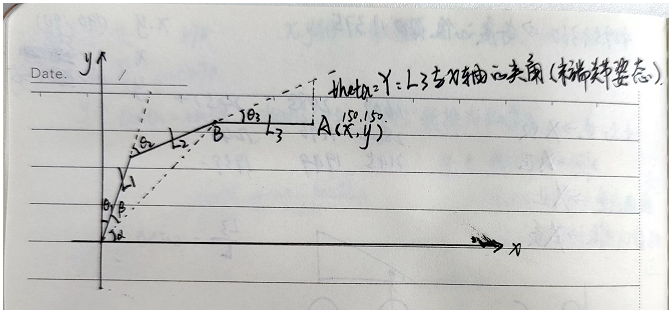

### 注意事项
1、该程序示例只对write.py文件进行操作更改，其余文件需要自行验证更改。
2、在进行修改的过程中需要先进行波特率和设备串口号更改。
3、舵机转动角度使用资料中：机械臂相关资料\舵机资料\FD19.8.1飞特调试软件\FD.exe 的软件进行查看
4、若需要添加摄像头识别功能在进行程序开发时需要注意：摄像头画面的平面和机械臂运动的平面是不相同的，需要进行坐标转换

### 文件解释

1、ping.py：查询工作状态，读取舵机的工作状态

2、read_write.py：从舵机内存控制表里读出数据和写数据到舵机内存控制表

3、read.py：从舵机内存控制表里读出数据

4、reg_write.py：异步写数据到舵机内存控制表

5、sync_read_write.py：同步向舵机内存控制表中读数据和写数据

6、sync_read.py：同步读取舵机内存控制表中的数据

7、sync_write.py：同步将数据写入舵机内存控制表

8、three_Inverse_kinematics.py：三连杆机械臂逆运动学算法，已知末端关节的位置和姿态（与X轴的夹角）求三个关节旋转的角度。

9、wheel.py：循环将数据写入舵机内存控制表中

10、write.py：将数据写入舵机内存控制表中

### 算法解析



L1、L2、L3分别为三根连杆的长度，θ1、θ2、θ3为与前杆的相对旋转角度。由于4、5号舵机连接结构与 3号的不同，3号:角度为正数 逆时针旋转 数值减小 -- 角度为负数 顺时针旋转 数值增大。4、5号:角度为正数 逆时针旋转 数值增大 -- 角度为负数 顺时针旋转 数值增大。

#### 求解过程

A点坐标和末端关节姿态（与X轴夹角为0° ）已知

①求B点坐标

Bx = x - L3 * math.cos(theta)

By = y - L3 * math.sin(theta)

②求θ1

cosβ = (Bx^2+ By^2 + L1^2 -L2^2) / (2* L1 *sqrt(Bx^2 +By^2));

β = acos(cosβ)*180/pi;

α = atan2(By,Bx)*180/pi;

θ1=－（pi/2-α-β）; //数学上θ1为正，但应用上应为负值
③求θ2

cosθ2 = (Bx^2 + By^2 - L1^2 - L2^2)/(2* L1 *L2);

θ2 = - acos(cosθ2 )*180/pi； //同理θ2改为负值

④求θ3

通过theta = θ1 + θ2 + θ3

求出θ3 = theta - θ1- θ2

**参考程序如下**

```python
import math	# 导入数学库

pi = 3.14	# 自定义pi

# 定义连杆长度，单位为毫米
L1 = 105     # L1
L2 = 100     # L2
L3 = 120     # L3

# 定义末端关节的位置为x,y，单位为毫米,末端关节姿态为theta（即 L3与X轴的夹角,这里设置为0 ），单位为弧度。这math.radians函数将角度转换为弧度
x = 190
y = 160
theta = math.radians(0) # 0为水平   负数向下    整数向上

# 计算中间位置Bx,By，即第二个关节的位置。这里用三角函数和末端关节的位置和姿态来求解
Bx = x - L3 * math.cos(theta)
By = y - L3 * math.sin(theta)

# 计算第一个和第二个关节的角度q1,q2，使用二连杆机械臂的逆运动学公式。
# 这里用math.acos和math.atan2函数来求解反余弦和反正切。使用math.sqrt函数求平方根
lp = Bx**2 + By**2
alpha = math.atan2(By,Bx) 
beta = math.acos((L1*L1 + lp - L2*L2) / (2*L1*math.sqrt(lp)))
q1 = -(pi/2.0-alpha-beta)
q2 = math.acos((L1*L1+L2*L2-lp)/(2*L1*L2))-pi

# 计算第三个关节的角度q3，使用末端关节的姿态（预先定义，theta）减去前两个角度得到。
# math.radians函数将角度转换为弧度
q3 = - q1 - q2 - pi/2

# 至此θ1、θ2、θ3分别为q1、q2、q3。
# q1、q2、q3为弧度制，使用math.degrees函数将弧度转为角度
angle_1 = math.degrees(q1)
angle_2 = math.degrees(q2)
angle_3 = math.degrees(q3)


```

坐标位置只针对y轴最大只能取到165的原因，因为程序要求末端关节与x轴的夹角为0，即末端关节的连杆始终与x轴平行，所以当y轴为0时，230 =<325;x轴尽量不为0，以免舵机卡在连杆初造成舵机损坏；x,y轴相同的情况下最大取到190，最小取到80.不同的情况下要自己计算。x轴不能取负值，y尽量不取负值。舵机旋转角度过大会因为卡在连杆造成堵转时使舵机损坏。
